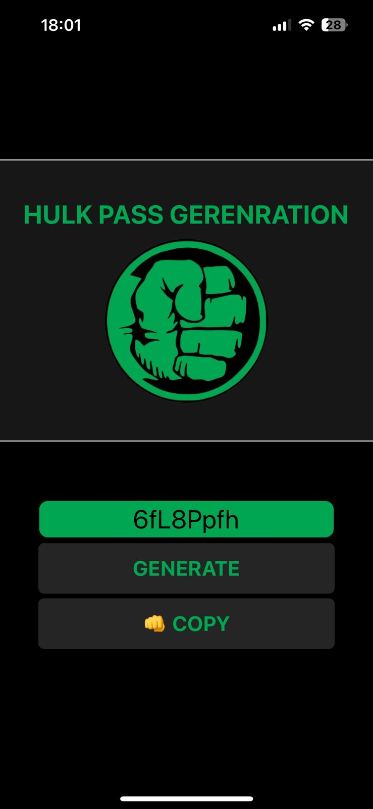

# 🟢 HULK PASS GENERATION  

  
  
  
  

Um gerador de senhas aleatórias e seguras com o tema do **Incrível Hulk**! 💪🏽🔐  

<p align="center">  
    
</p>  

---

## ✨ Funcionalidades  

- 🎯 **Geração de Senhas Aleatórias** – Senhas fortes de até 12 caracteres  
- 💪🏽 **Tema Hulk** – Interface verde e temática do Hulk  
- 📋 **Cópia Automática** – Copie senhas com um toque  
- 🎨 **Design Responsivo** – Funciona em iOS e Android  
- ⚡ **Rápido e Leve** – Desenvolvido com React Native + Expo  
- 🔒 **Indicador de Força** – Mostra a segurança da senha gerada  
- 🎭 **Animações Temáticas** – Efeitos visuais do Hulk  

---

## 📱 Preview  

<div align="center">  
    
</div>  

---

## 🛠️ Tecnologias Utilizadas  

- **React Native 0.72** – Framework mobile cross-platform  
- **Expo SDK 49** – Desenvolvimento rápido e simplificado  
- **TypeScript 5.0** – Tipagem estática e melhor desenvolvimento  
- **Styled Components** – Estilização componentizada  
- **React Navigation** – Navegação entre telas (se aplicável)  
- **React Native Clipboard** – Manipulação da área de transferência  

---

## 📦 Pré-requisitos  

- Node.js 16+  
- npm ou yarn  
- Expo Go app (para testar no dispositivo físico)  
- Android Studio/Xcode (para emuladores)  

---

## 🔧 Instalação  

```bash  
# Clone o repositório  
git clone https://github.com/seu-usuario/hulk-pass-generation.git  

# Acesse a pasta do projeto  
cd hulk-pass-generation  

# Instale as dependências  
npm install  

# ou com yarn  
yarn install  
```  

---

## 🚀 Como Executar  

```bash  
# Desenvolvimento com Expo  
npx expo start  

# Abrirá o Metro Bundler no navegador  
# Escaneie o QR code com o app Expo Go no seu celular  

# Para executar em emulador:  

# Android  
npx expo run:android  

# iOS (requer macOS)  
npx expo run:ios  

# Para build de produção:  
npx expo build:android  
npx expo build:ios  
```  

---

## 🎮 Como Usar  

1. **Toque em "GENERATE"** – Gera uma nova senha aleatória  
2. **Visualize a senha** – Exibida no campo central (ex: `6fL8Ppfn`)  
3. **Verifique a força** – Indicador mostra a segurança da senha  
4. **Toque em "COPY"** – Copia automaticamente para a área de transferência  
5. **Use a senha** – Cole onde precisar de segurança extra!  

---

## 📁 Estrutura do Projeto  

```  
src/
├── components/
│   ├── HulkLogo/           # Logo e título
│   ├── HulkTextInput/      # Campo de senha
│   ├── HulkButton/         # Botões GENERATE/COPY
├── assets/
│   └── hulk-logo.png       # Assets visuais
├── services/
│   └── passwordServices.ts # Lógica do gerador
├── screens/
│   ├── Home.tsx            # Componente principal
│   └── Styles.tsx          # Componete de estilização geral
└── App.tsx                 # Componente geral
```  

---

## 🔧 Desenvolvimento  

### Scripts Disponíveis  

```bash  
# Desenvolvimento  
npm start  

# Build para produção  
npm run build  

# Testes (se configurado)  
npm test  

# Lint do código  
npm run lint  

# Type checking  
npm run type-check  
```  

### Adicionando Novas Funcionalidades  

1. **Crie componentes na pasta `components/`**  
2. **Adicione tipos em `types/`**  
3. **Mantenha os estilos organizados por componente**  
4. **Teste em ambas plataformas (iOS/Android)**  

---

## 🤝 Contribuindo  

Contribuições são bem-vindas! Siga estos passos:  

1. **Fork o projeto**  
2. **Crie uma branch para sua feature**  
   ```bash  
   git checkout -b feature/nova-feature-incrivel  
   ```  
3. **Commit suas mudanças**  
   ```bash  
   git commit -m 'feat: adiciona nova feature incrível do Hulk'  
   ```  
4. **Push para a branch**  
   ```bash  
   git push origin feature/nova-feature-incrivel  
   ```  
5. **Abra um Pull Request**  

### Padrões de Commit  

- `feat:` Nova funcionalidade  
- `fix:` Correção de bugs  
- `docs:` Documentação  
- `style:` Formatação de código  
- `refactor:` Refatoração de código  

---

## 🐛 Reportando Bugs  

Encontrou um bug? [Abra uma issue](https://github.com/Kitinport1/hulk-pass-generation/issues) com:  

1. Descrição detalhada do bug  
2. Passos para reproduzir  
3. Comportamento esperado vs atual  
4. Screenshots (se aplicável)  
5. Versão do app e dispositivo  

---

## 📄 Licença  

Este projeto está sob a licença MIT. Veja o arquivo [LICENSE](LICENSE) para detalhes completos.  

```text  
MIT License  

Permissão é concedida, gratuitamente, a qualquer pessoa que obtenha uma cópia  
deste software e documentação associada, para usar, copiar, modificar, fundir,  
publicar, distribuir, sublicenciar e/ou vender cópias do software...  
```  

---

## 👨‍💻 Autor  

**Lua** – [GitHub](https://github.com/Kitinport1) – [Email](limalauane@outlook.com)  

---

## 🙏 Agradecimentos  

- **Marvel Comics** – Pelo personagem Incrível Hulk  
- **Comunidade React Native** – Pelo suporte incrível  
- **Expo** – Pela plataforma fantástica  
- **Contribuidores** – Todos que ajudaram no projeto  

---

## 🔗 Links Úteis  

- [Documentação React Native](https://reactnative.dev)  
- [Documentação Expo](https://docs.expo.dev)  
- [TypeScript Documentation](https://www.typescriptlang.org)  
- [React Native Elements](https://reactnativeelements.com)  

---

<p align="center">  
  <strong>💚 Desenvolvido com a força do Hulk! 💚</strong>  
</p>  

<div align="center">  

  
  
  
  

</div>  

---  

> **⭐️ Se este projeto te ajudou, deixe uma estrela no GitHub! ⭐️**  

> *"HULK SMASH PASSWORDS! 💪🏽🔐" – Versão 1.0.0*  

---  

Esse README está completo e pronto para ser usado no seu repositório! 😊
